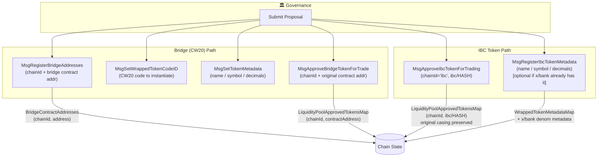
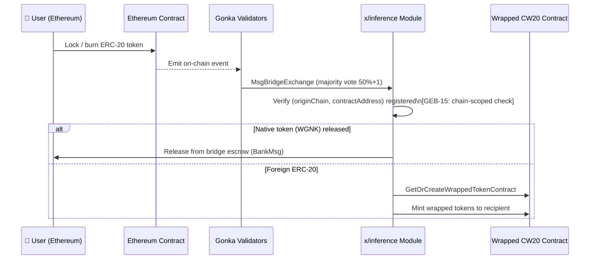
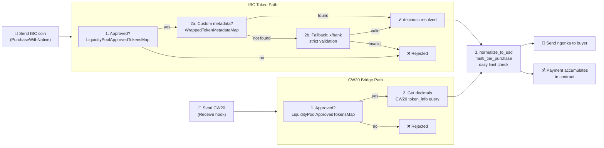
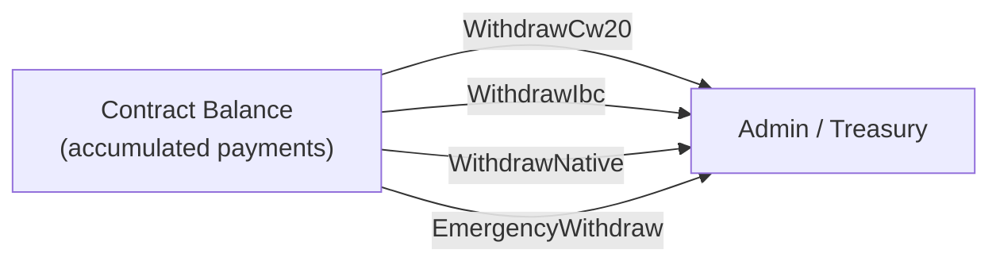
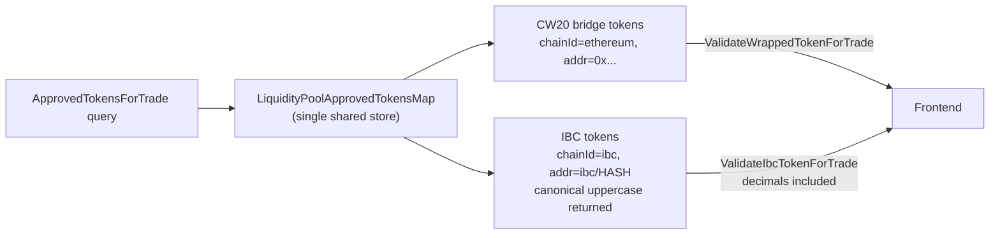

# IBC & Wrapped Token Cycle

Two parallel token paths lead into the Gonka Liquidity Pool. Both go through governance approval before any user can trade with them.

---

## 1 · Governance Setup Phase

---

## 2 · Bridge (Ethereum → Gonka) Token Inbound

---

## 3 · Trading in the Liquidity Pool

---

## 4 · Admin Withdrawal

---

## 5 · Unified Token Discovery (UI / Frontend)

---

## Key Design Principles

| Concern | CW20 (Bridge) | IBC |
|---|---|---|
| **Registration** | `MsgRegisterBridgeAddresses` + `MsgApproveBridgeTokenForTrade` | `MsgApproveIbcTokenForTrading` |
| **Metadata** | `MsgSetTokenMetadata` (custom store) | `MsgRegisterIbcTokenMetadata` → also writes x/bank |
| **Decimals source** | CW20 `token_info` query | governance store → fallback to x/bank |
| **Validation query** | `ValidateWrappedTokenForTrade` | `ValidateIbcTokenForTrade` |
| **Payment accumulation** | Contract holds CW20 | Contract holds IBC coins |
| **Admin withdrawal** | `WithdrawCw20` | `WithdrawIbc` |
| **Approval store** | `LiquidityPoolApprovedTokensMap` | same map (unified) |
| **Casing** | lowercase normalized | original casing preserved (`ibc/UPPERCASE`) |
